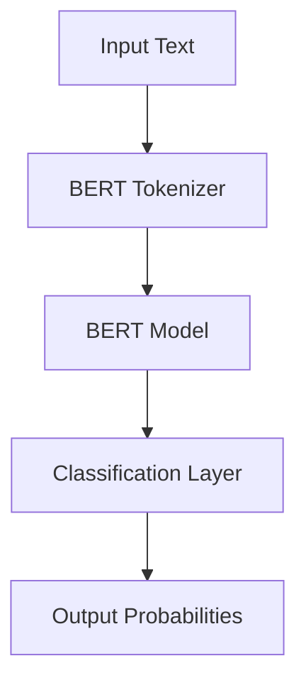

# Project Structure and Organization 📁

This document explains the organization and structure of the Nepali Sentiment Analysis project, helping you understand where everything is and why it's there.

## Directory Structure 🗂️

```
nepali-sentiment-analysis/
├── model_training.ipynb     # Main training notebook
├── README.md               # Project overview
├── docs/                   # Documentation directory
│   ├── 01-GETTING_STARTED.md
│   ├── 02-PROJECT_STRUCTURE.md
│   └── ...
├── test.csv               # Test dataset
├── train.csv              # Training dataset
├── trained_model/         # Saved model directory
└── my-model.zip          # Compressed model for sharing
```

## Key Components Explained 🔍

### 1. Jupyter Notebook (`model_training.ipynb`)

The main notebook contains several logical sections:

#### a. Library Imports
```python
from transformers import TFAutoModel, AutoTokenizer, BertForSequenceClassification
import matplotlib.pyplot as plt
import pandas as pd
import torch
# ...etc
```
- **Purpose**: Sets up all required dependencies
- **Why These Libraries?**:
  - `transformers`: Provides BERT model and tokenizer
  - `matplotlib`: For visualization of training progress
  - `pandas`: For dataset handling
  - `torch`: Deep learning framework
  - `sklearn`: For preprocessing utilities

#### b. Data Loading and Preprocessing
```python
df_train = pd.read_csv('test.csv')
df_test = pd.read_csv('train.csv')
```
- Loads datasets
- Handles missing values
- Converts data types
- Prepares text and labels

#### c. Model Setup
```python
model = BertForSequenceClassification.from_pretrained(
    'bert-base-multilingual-cased',
    num_labels=3
)
```
- Initializes BERT model
- Configures for 3-class classification
- Sets up tokenizer

#### d. Training Loop
```python
for epoch in range(epochs):
    # Training code
```
- Implements the training process
- Tracks metrics
- Updates model parameters

#### e. Visualization
- Plots training loss
- Shows accuracy metrics
- Displays data distribution

### 2. Datasets

#### `train.csv` and `test.csv`
Structure:
```csv
text,label
"तपाईंको फिल्म राम्रो छ",1
"यो फिल्म मन परेन",0
"ठिकै छ",2
```

- **text**: Nepali text content
- **label**: Sentiment (0=Negative, 1=Positive, 2=Neutral)

### 3. Model Files

#### `trained_model/` Directory
Contains:
- `config.json`: Model configuration
- `pytorch_model.bin`: Model weights
- `tokenizer.json`: Tokenizer configuration
- `vocab.txt`: BERT vocabulary file

#### `my-model.zip`
- Compressed version of trained model
- Useful for sharing or deployment

## Code Organization 📝

### 1. Data Processing Pipeline


### 2. Model Architecture


## Best Practices Used 👌

1. **Code Organization**
   - Clear section separation
   - Comprehensive comments
   - Logical flow of operations

2. **Data Handling**
   - Proper validation checks
   - Missing value handling
   - Data type conversion

3. **Model Training**
   - Learning rate optimization
   - Gradient clipping
   - Progress tracking

4. **Documentation**
   - Inline comments
   - Markdown cells
   - Performance metrics

## Development Guidelines 📋

When working with this project:

1. **Adding New Features**
   - Create new notebook cells logically
   - Document changes thoroughly
   - Validate results

2. **Data Preprocessing**
   - Always check for missing values
   - Validate label distribution
   - Ensure proper encoding

3. **Model Training**
   - Monitor GPU memory usage
   - Save checkpoints regularly
   - Log training metrics

## Performance Considerations ⚡

1. **Memory Usage**
   - Batch size adjustment
   - Gradient accumulation
   - Model precision options

2. **Processing Speed**
   - GPU utilization
   - Data loading optimization
   - Tokenizer caching

## Next Steps 🚀

After understanding the project structure:
1. Review the [Technical Details](03-TECHNICAL_DETAILS.md)
2. Explore the [Dataset Guide](04-DATASET_GUIDE.md)
3. Study the [Model Training](05-MODEL_TRAINING.md) process