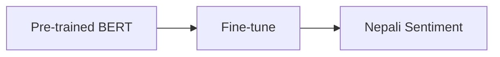

# Theory and Concepts - Nepali Sentiment Analysis 🎓

This document explains the theoretical concepts behind the Nepali Sentiment Analysis project in a way that's accessible for undergraduate students with moderate Python knowledge.

## Natural Language Processing Fundamentals 📚

### What is NLP? 🤔

Natural Language Processing (NLP) is like teaching computers to understand and work with human language. Think of it as:
- 🗣️ Understanding spoken words
- 📝 Reading written text
- 🤖 Making sense of language patterns
- 🎯 Extracting meaning from text

### Key NLP Concepts

1. **Tokenization**
   ```
   Input: "तपाईंको फिल्म राम्रो छ"
   Tokens: ["तपाई", "##ं", "##को", "फिल्म", "राम्रो", "छ"]
   ```
   - Like breaking a sentence into words
   - Helps computer process text piece by piece
   - Special handling for Nepali characters

2. **Word Embeddings**
   ```
   Word → [0.2, -0.5, 0.8, ...]
   ```
   - Converting words to numbers
   - Captures word relationships
   - Maintains meaning in vector space

## Sentiment Analysis 😊

### What is Sentiment Analysis?

Sentiment Analysis is determining the emotional tone of text:
- 😊 Positive feelings
- 😐 Neutral statements
- ☹️ Negative feelings

### Why is it Important?
- 📊 Understanding customer feedback
- 📈 Analyzing social media
- 🎯 Gauging public opinion
- 📱 Improving user experience

## BERT Architecture Deep Dive 🏗️

### What Makes BERT Special?

BERT (Bidirectional Encoder Representations from Transformers) is like a language understanding expert:

1. **Bidirectional Understanding**
   ```
   "राम्रो फिल्म [MASK] छ"
   ↑ Looks at context from both directions
   ```
   - Understands context from both sides
   - Better than one-way models
   - More like how humans read

2. **Pre-training & Fine-tuning**
   ```mermaid
   graph TD
   A[Pre-training on Wikipedia] --> B[General Language Understanding]
   B --> C[Fine-tune for Sentiment]
   ```

### BERT's Components

1. **Input Embedding Layer**
   ```
   Word + Position + Segment = Input Embedding
   ```
   - Word: What the word means
   - Position: Where it appears
   - Segment: Which part of input

2. **Attention Mechanism**
   ```
   Query * Key = Attention Score
   ```
   - Like focusing on important words
   - Connects related words
   - Handles long-range dependencies

## Deep Learning Basics 🧠

### Neural Networks Simplified

Think of neural networks like a chain of smart filters:
```
Input → Layer 1 → Layer 2 → ... → Output
```

Each layer:
- Takes input
- Applies transformations
- Passes results forward

### Training Process

1. **Forward Pass**
   ```python
   # Simplified forward pass
   def forward(text):
       embedding = embed_text(text)
       features = process_features(embedding)
       prediction = make_prediction(features)
       return prediction
   ```

2. **Backward Pass (Learning)**
   ```python
   # Simplified learning step
   prediction = model(text)
   loss = calculate_error(prediction, true_label)
   loss.backward()  # Learn from mistakes
   ```

## Nepali Language Processing 🇳🇵

### Unique Challenges

1. **Character Set**
   ```python
   # Nepali Unicode range
   nepali_chars = '\u0900-\u097F'
   ```
   - Different from Latin alphabet
   - Complex character combinations
   - Special handling needed

2. **Word Structure**
   ```
   Base word + Modifiers = Complete Word
   राम + रो = राम्रो
   ```
   - Morphologically rich
   - Many word variations
   - Context-dependent meanings

### Solutions Used

1. **Multilingual BERT**
   - Pre-trained on many languages
   - Understands Nepali script
   - Handles character variations

2. **Subword Tokenization**
   ```
   तपाईंको → तपाई + ##ं + ##को
   ```
   - Breaks down complex words
   - Handles unseen words
   - Preserves meaning

## Mathematics Behind the Scenes 📐

### Vector Operations

1. **Word Embeddings**
   ```
   Word → Vector (768 dimensions in BERT)
   ```
   - Each word becomes a point in space
   - Similar words are closer together
   - Mathematical operations possible

2. **Attention Calculation**
   ```
   Attention = Softmax(QK^T)V
   ```
   - Q: Query vector
   - K: Key vector
   - V: Value vector

### Loss Functions

Cross-Entropy Loss for classification:
```python
def cross_entropy(predictions, true_labels):
    return -sum(true_labels * log(predictions))
```

## Advanced Concepts 🔬

### 1. Transfer Learning

- Using pre-learned knowledge
- Adapting to new tasks
- Saving training time

### 2. Attention Mechanisms
```
Word1 ↔️ Word2 ↔️ Word3 ↔️ Word4
```
- Each word looks at others
- Weights connections
- Captures relationships

### 3. Gradient Descent
```python
# Simplified gradient descent
new_params = old_params - learning_rate * gradients
```
- Finding best parameters
- Step by step improvement
- Learning from errors

## Visual Explanations 🎨

### BERT Architecture
```
[CLS] तपाईंको फिल्म राम्रो छ [SEP]
   ↓     ↓     ↓    ↓    ↓   ↓
   E1    E2    E3   E4   E5  E6
   ↓     ↓     ↓    ↓    ↓   ↓
Transformer Encoder Layers (12x)
   ↓     ↓     ↓    ↓    ↓   ↓
Final Representations
```

### Attention Visualization
```
    तपाईंको  फिल्म  राम्रो   छ
तपाईंको  [0.1]   [0.2]   [0.4]  [0.3]
फिल्म    [0.2]   [0.3]   [0.3]  [0.2]
राम्रो    [0.3]   [0.2]   [0.3]  [0.2]
छ        [0.2]   [0.1]   [0.4]  [0.3]
```

## Resources for Learning 📚

### Mathematics and Statistics
1. [Linear Algebra Review](https://www.youtube.com/watch?v=fNk_zzaMoSs)
2. [Probability Basics](https://www.khanacademy.org/math/statistics-probability)
3. [Calculus for Machine Learning](https://www.youtube.com/watch?v=8RJLPd_72As)

### Deep Learning
1. [Neural Networks Explained](https://www.3blue1brown.com/topics/neural-networks)
2. [Attention Mechanism](https://www.youtube.com/watch?v=iDulhoQ2pro)
3. [BERT Paper Explained](https://www.youtube.com/watch?v=xI0HHN5XKDo)

### Nepali Language Resources
1. [Nepali Unicode Guide](https://unicode.org/charts/PDF/U0900.pdf)
2. [Nepali Grammar](https://www.translatorsavenue.com/nepali-grammar/)
3. [Nepali NLP Resources](https://github.com/sushil79g/Nepali_nlp)

## Practice Exercises 📝

### 1. Understanding Embeddings
```python
# Try visualizing word embeddings
from sklearn.manifold import TSNE
import matplotlib.pyplot as plt

# Get embeddings for Nepali words
embeddings = model.get_input_embeddings().weight.detach().numpy()
# Plot in 2D space
tsne = TSNE(n_components=2)
reduced_embeddings = tsne.fit_transform(embeddings)
```

### 2. Attention Analysis
```python
# Analyze attention patterns
def visualize_attention(text):
    inputs = tokenizer(text, return_tensors="pt")
    outputs = model(**inputs, output_attentions=True)
    attention = outputs.attentions[-1].mean(dim=1)
    # Plot attention heatmap
    plt.imshow(attention[0].detach().numpy())
    plt.show()
```

## Next Steps 🎯

1. Try implementing the concepts in the [Usage Guide](06-USAGE_GUIDE.md)
2. Experiment with the model using examples from [Model Training](05-MODEL_TRAINING.md)
3. Contribute to improving the project!